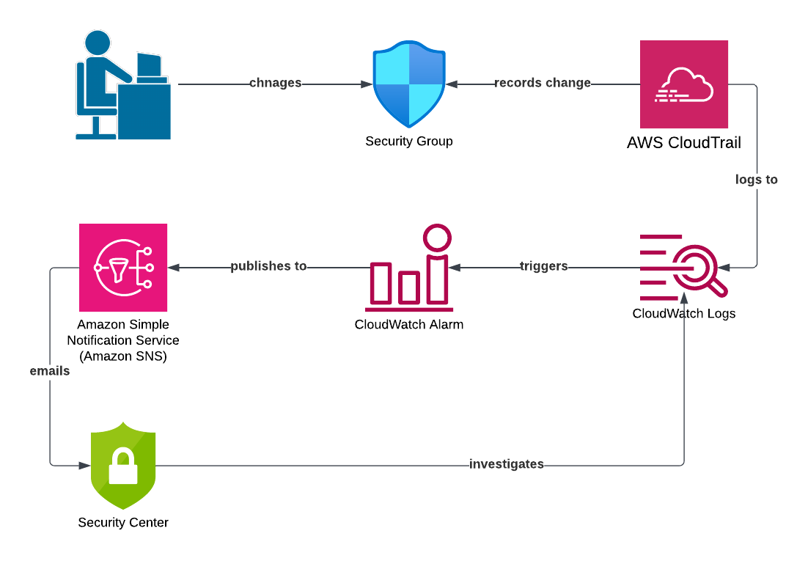

# cloudtrail-metric-filter
This Terraform script uses a Amazon CloudWatch metric filter and alarm to trigger off CloudTrail logs when a security group changes.  The alarm publishes a message to SNS which delivers a message to the given email address.  The file sample_alarm_message.txt shows a sample of a email body.  Note the body text is more about the alarm itself than what triggered it.  It does not show details of the security group.  CloudWatch metric filters are better for detecting events in aggregate (the security group rule was changes x times in y seconds).  This may not be appropriate in this specific example.

The response to a single security group change is not as quick as the architecture in the repository 'cloudtrail-eventbridge'.  It can take a few minutes after the actual event for the email to arrive.

To use the Terraform script, first substitute your email address in the 'sns_email' variable in terraform.tfvars than apply the script.  Try experimenting with the attributes in 'resource "aws_cloudwatch_metric_alarm" "demo_alarm"' in cloudwatch.tf.

